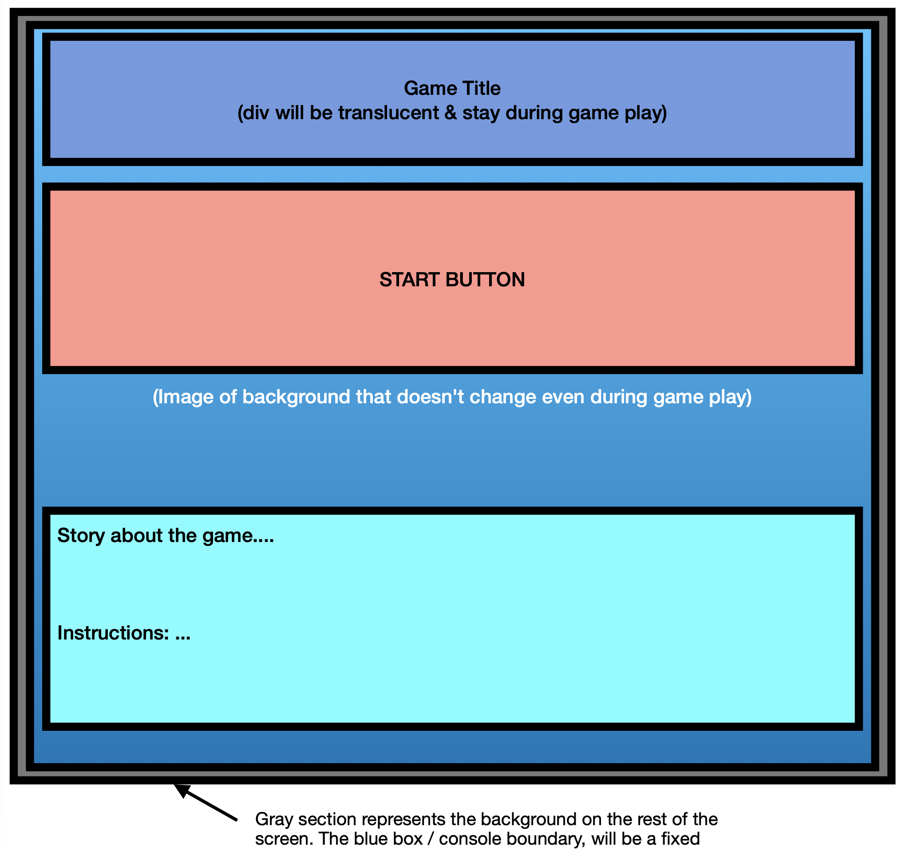
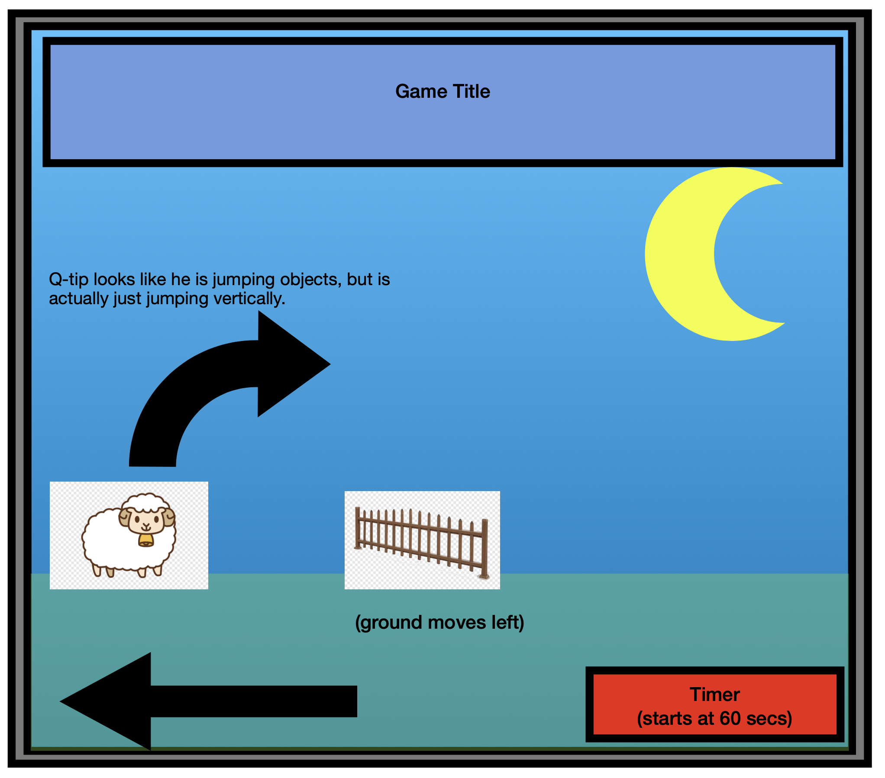
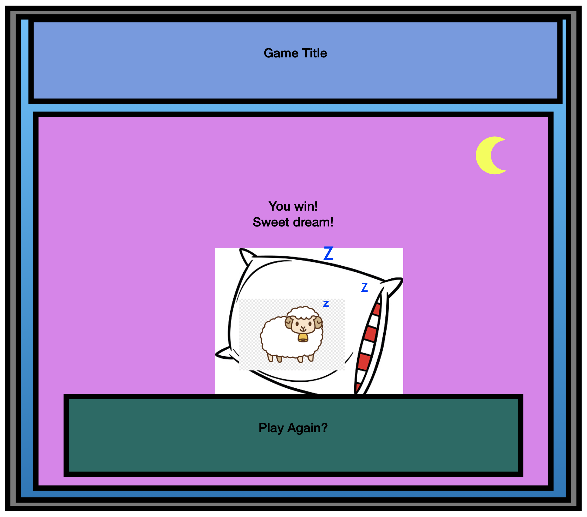
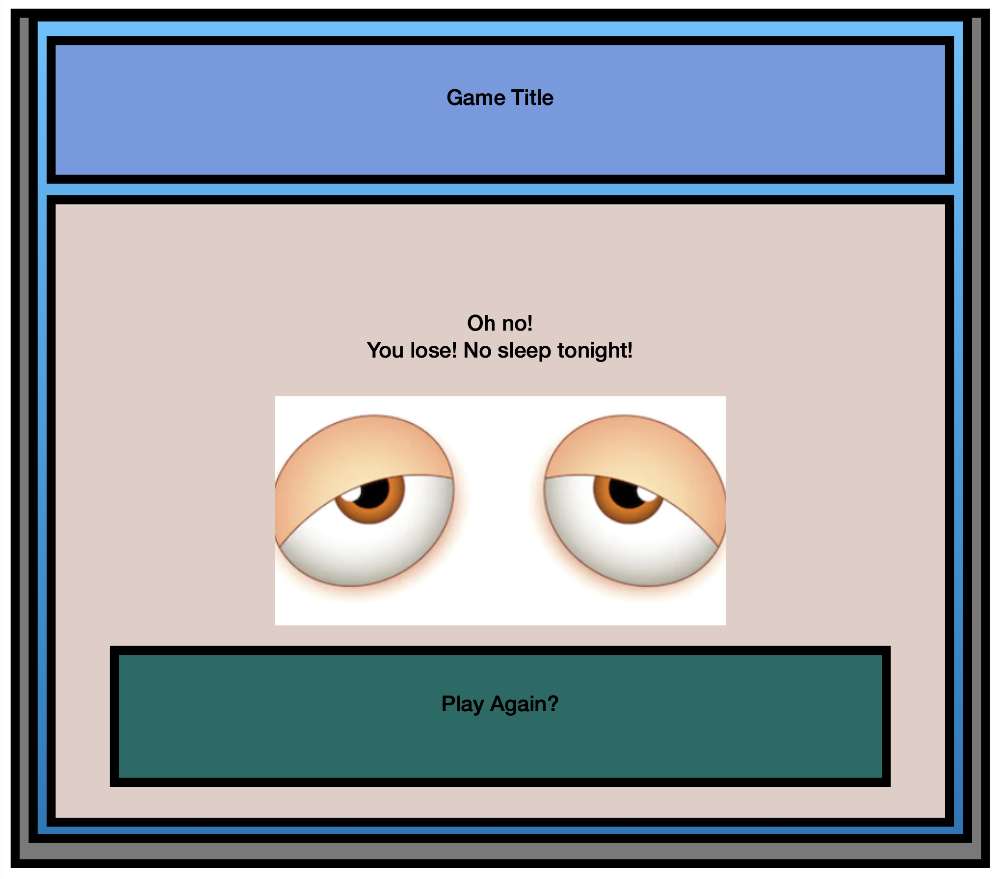

### P1-Sleep-Game

<h1> Q-tip </h1>

*Title Ideas: "Bahhh Humbug" or "Q-tip & The Race to Bed"

<h3> Overview </h3>

Game Inspiration

My game is based on the Running Dinosaur Game that can be found in Chrome's extensions.

Theme

Instead of a Dinosaur running with abandon through Joshua Tree, my game will be hitting a little closer to home. It will feature a a cute little lamb taken straight from your drowsy subconscious mind.

Q-tip, our curly little friend, is doing his darn best to jump over objects in his way to the end zone where you two can finally get some shuteye!

<h3> Rules </h3>

Breakdown

The start screen will include a Start Button, Game Instructions & a Backstory.
Once start has been pushed, a timer will begin in the bottom right corner of the screen and you have control of Q-tip. He only jumps, and that can be done by pressing the space-bar.

The background image will stay fixed, yet small objects bushes and fences start panning towards you creating the illusion that you are running forwards. You must clear the objects for 1 minute to make it to the end and win the game.

If you win, there will be a pillow for you to lay your fluffy little lamb head down to sleep. If you don't make it over an object and lose a screen will pop up over your game that complains you you've lost and has an image of tired eyes. The loser screen also offers you a reset button.

An additional event I'd like to add to the game, if I have time, is to "catch some Z's." Meaning, little z's [img]https://i.imgur.com/gu4zStt.png[/img]will float just in reach as you jump. If you get one it knocks 10 seconds off your time.

----------------------------------------------------------------------------------------------------------------------------------------------------------------------------------

## Link:

https://github.com/AlrightErin27/P1-Sleep-Game.git ,  
OG game: [DinoRunGame](https://i.imgur.com/gu4zStt.png).

----------------------------------------------------------------------------------------------------------------------------------------------------------------------------------

<h1> Wire-Frame </h1>

- User stories: a series of statements in the form of "When I {do X}, {Y happens}." These statements should encompass the whole functionality of playing the game.
  - MVP checklist: A list of all the functionalities that will constitute the bare minimum version of your game. Note that this list should be sized so that you can complete it by ~Thursday of P1 week, leaving Friday-Saturday-Sunday to tackle stretch goals.
  - Stretch goals: A list of awesome bonus goals you will work on after completing your MVP.
  

----------------------------------------------------------------------------------------------------------------------------------------------------------------------------------

  
<h1>User Story</h2>

  
1. Starting screen- offers start button.

  
2. Once started: 

  -timer starts at 60 seconds and counts down

  -obstacles move horizontally left, then off screen

  -user can make Q-tip (near left side of screen) jump vertically to avoid colliding with the objects moving left

  
3. If...

  
a. Q-tip runs into an object = losing screen <-> 4. Losing screen appears with reset button

  
b. Q-tip avoids all objects for 60 seconds = winning screen <-> 4. Winning screen appears with reset button

  

----------------------------------------------------------------------------------------------------------------------------------------------------------------------------------

    
<h1>MVP & Stretch Goals</h1>

  <h2>MVP</h2>
  
-Start Screen: info, instructions & start button.

  
-Timer that starts when start button is clicked. -don't need to show on screen- when it ends go to Loser Screen.

  
-Character that moves up & down via clicking anywhere in the "console" screen.

  
-Objects that moved from right to left horizontally along ground.

  
-Create canvas "collision" feature when the 2 objects above touch- got to Loser Screen if they collide.

  
-If the objects do not touch then Winner Screen.

  
-Winner & Loser Screens with restart buttons.

  <h2>Stretch</h2>
  
-Add sound effects.

  
-Have timer appear on screen.

  
-"Catching Z's" floating 'z's that if you collide with subtract 10 seconds off you timer.

